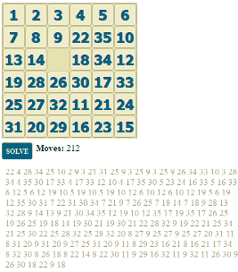

ClojureScript N-puzzle solver.

Uses a simple greedy algorithm.

[Online demo](http://www.ruslans.com/npuzzle?nums=1,10,25,33,12,19,14,2,34,26,17,6,18,9,31,4,30,16,28,3,21,22,35,24,13,32,7,0,5,23,27,8,20,11,29,15).

[Annotated source](http://www.ruslans.com/npuzzle/docs/uberdoc.html)
